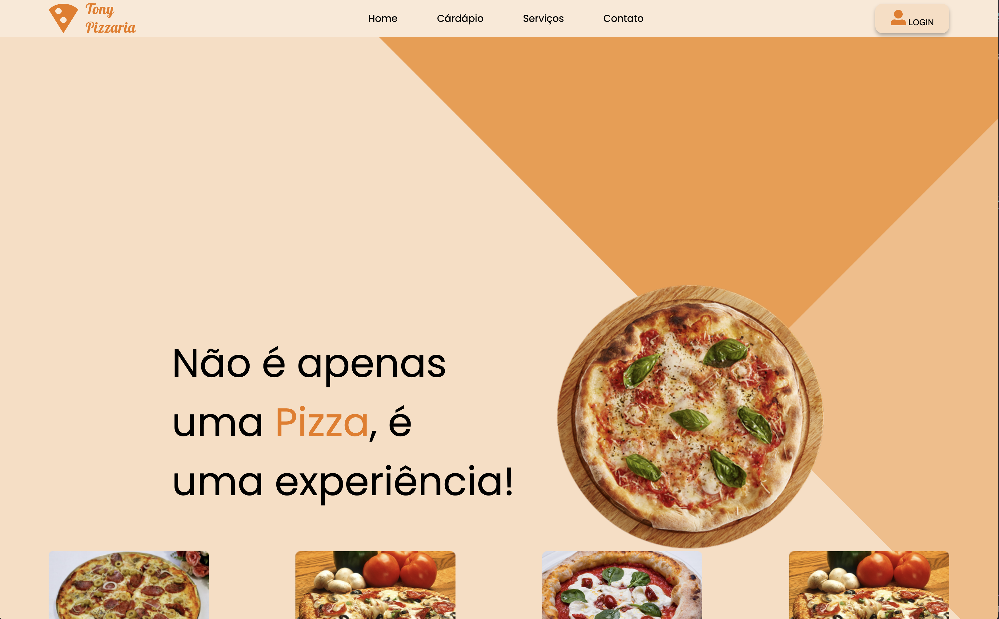
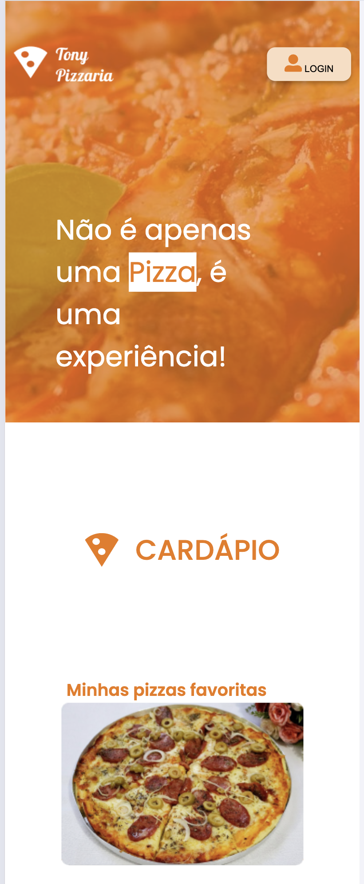

# tony-pizzaria

## Desktop

## Tablet

## Celular

## Descrição
Projeto tony-pizzaria usando HTML e CSS, desenvolvido durante a disciplina de Linguagem de Marcação da escola SENAI de Jandira.

## Tecnologias
* HTML
* CSS
* git
* Figma
& github

## Autor
[Carlos Eduardo.](https://www.linkedin.com/in/carlos-eduardo-silva-pereira-a2413b353/)